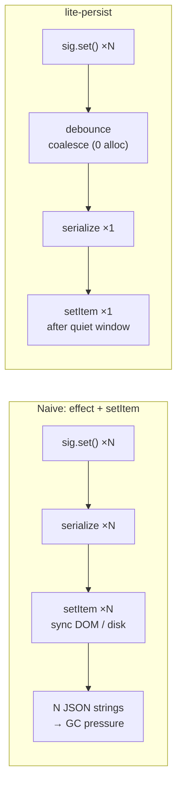
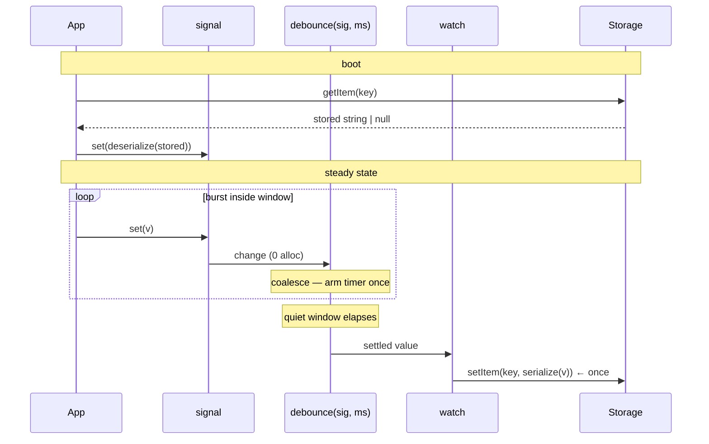
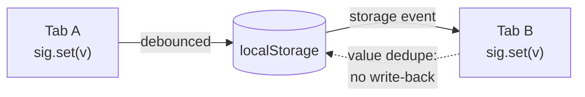
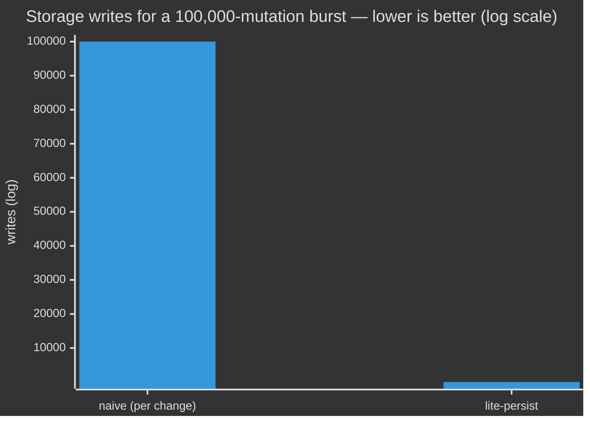

# @zakkster/lite-persist

[](https://www.npmjs.com/package/@zakkster/lite-persist)
[](https://bundlephobia.com/result?p=@zakkster/lite-persist)
[](https://www.npmjs.com/package/@zakkster/lite-persist)
[](https://www.npmjs.com/package/@zakkster/lite-persist)
[](https://github.com/PeshoVurtoleta/lite-signal)

[](https://opensource.org/licenses/MIT)

**Reactive `localStorage` for [lite-signal](https://www.npmjs.com/package/@zakkster/lite-signal), without the write storm.**

Bind a signal to a storage key in one line. It reads on boot, writes on change — but a *burst* of changes collapses into a **single** write after a quiet window. The mutation hot path stays allocation-free, so you can persist a value that updates every frame without touching the disk every frame.

```js
import { signal } from '@zakkster/lite-signal';
import { persist } from '@zakkster/lite-persist';

const volume = signal(80);
persist(volume, 'settings.volume');   // restored on boot, saved on change

volume.set(81);   // …
volume.set(82);   // …  three synchronous writes to the signal
volume.set(83);   // …  → ONE write to localStorage, 50 ms later, value 83
```

That's the whole API surface for the common case. Everything below is detail.

> **Measured** (Node v22, `npm run bench`): a burst of **100,000** signal mutations inside one window produces **0** storage writes during the burst and **1** at settle — versus **100,000** for write-on-every-change. The hot path grows **< 4 KB across 100k mutations** (~0.04 bytes each), and absorbs **~6 million mutations/sec**.

---

## Contents

- [Why](#why) · [Install](#install) · [Quick start](#quick-start)
- [How it works](#how-it-works)
- [Cross-tab sync](#cross-tab-sync)
- [API reference](#api-reference)
- [Benchmarks](#benchmarks)
- [Testing (for clients & QA)](#testing-for-clients--qa)
- [Running the demo](#running-the-demo)
- [Edge cases & guarantees](#edge-cases--guarantees)
- [FAQ](#faq) · [License](#license)

---

## Why

Persisting reactive state to `localStorage` looks trivial, and the first version you write is:

```js
// The code you write first, and regret later
effect(() => {
  localStorage.setItem('state', JSON.stringify(myState()));
});
```

This fires `setItem` on **every** change. `localStorage` is synchronous and main-thread — each call serializes, crosses into the DOM, and may hit disk. Wire it to anything that changes quickly (a slider drag, a text field, a HUD value, an autosave) and you get a **write storm**: dozens of synchronous disk writes per second, plus a fresh JSON string allocated each time, feeding the garbage collector mid-interaction.

`@zakkster/lite-persist` puts a **coalescing barrier** between the signal and storage. Rapid changes are absorbed; only the *settled* value is written, once.



### What this is *not*

- **Not a state manager.** It persists a signal you already have; it doesn't create or own your state.
- **Not async storage.** It targets the synchronous Web Storage contract (`localStorage` / `sessionStorage`) and anything with the same three methods. For IndexedDB, wrap it in a custom adapter.
- **Not a migration framework.** Versioning/migration is your `deserialize` function's job (and a good place for it).

---

## Install

```bash
npm i @zakkster/lite-persist
```

ESM-only. Ships TypeScript definitions. `@zakkster/lite-signal` is a **peer dependency** — you already have it, and this keeps everything on a single reactive graph. `@zakkster/lite-debounce` is pulled in automatically.

```js
import { persist } from '@zakkster/lite-persist';
```

---

## Quick start

```js
import { signal } from '@zakkster/lite-signal';
import { persist } from '@zakkster/lite-persist';

// A signal of any JSON-serializable value.
const prefs = signal({ theme: 'dark', volume: 80 });

// Bind it. Returns a disposer.
const stop = persist(prefs, 'app.prefs', {
  debounce: 50,          // coalesce window (ms). 0 = microtask.
  syncTabs: true,        // mirror across browser tabs
  storage: localStorage, // or sessionStorage, or a custom adapter
});

prefs.set({ theme: 'light', volume: 80 });  // saved 50 ms later
prefs.update?.(p => ({ ...p, volume: 90 })); // if your signal exposes update()

// On teardown:
stop();
```

`sessionStorage` instead of `localStorage`:

```js
persist(draft, 'editor.draft', { storage: sessionStorage });
```

Setting a signal to `undefined` **removes** the key:

```js
const token = signal(loadToken());
persist(token, 'auth.token');
token.set(undefined);   // → localStorage.removeItem('auth.token')
```

---

## How it works

The core insight: `debounce(sig, ms)` from `@zakkster/lite-debounce` is a **reactive combinator**, not a callback wrapper. It returns a read-only derived value that mirrors the source signal, trailing-debounced. We simply `watch` that derived value and write on each settled change.



1. **Boot read is synchronous.** The stored value is restored into your signal before `persist()` returns, so first paint sees the persisted state — no flash of defaults.
2. **Writes are coalesced.** Each `sig.set()` only nudges a sliding-timestamp timer (zero allocation per change). The serialize + `setItem` happens once, after the window goes quiet.
3. **Writes are de-duplicated by value.** A settled value equal to what's already stored is skipped — including the freshly-deserialized object arriving from another tab, which is what stops cross-tab sync from echoing.

---

## Cross-tab sync

With `syncTabs: true` (the default), a write in one tab updates the bound signal in every other tab via the native `storage` event:



The subtle part is the dashed arrow. When Tab B receives the event it sets its own signal, which would normally schedule a *write back* to storage — and for object values (where `Object.is` never matches two equal-but-distinct references) that would ping-pong between tabs forever. lite-persist primes its value-level dedupe with the incoming string, so the echoed write is recognized and dropped. This is covered by a dedicated test.

> Cross-tab sync only works with real Web Storage (`localStorage` / `sessionStorage`), because only those emit `storage` events. Custom adapters sync on boot but not live.

---

## API reference

### `persist(sig, key, options?) → dispose`

| Arg | Type | Description |
|---|---|---|
| `sig` | `Signal<T>` | The signal to track. Read on boot, watched thereafter. |
| `key` | `string` | Storage key. |
| `options` | `PersistOptions<T>` | Optional. See below. |

Returns an **idempotent** `() => void` disposer: stops watching, removes the cross-tab listener, and (if `flushOnDispose`) commits the pending value.

### `PersistOptions<T>`

| Option | Type | Default | Description |
|---|---|---|---|
| `storage` | `StorageLike` | `localStorage` | Any object with `getItem` / `setItem` / `removeItem`. |
| `debounce` | `number` | `50` | Coalesce window in ms. `0` flushes on the next microtask. |
| `syncTabs` | `boolean` | `true` | Mirror changes across tabs via the `storage` event. |
| `flushOnDispose` | `boolean` | `false` | If `true`, commit a value still inside the window when `dispose()` is called. See note below. |
| `serialize` | `(value: T) => string` | `JSON.stringify` | Value encoder. |
| `deserialize` | `(str: string) => T` | `JSON.parse` | Value decoder. A natural place for schema migration. |

`StorageLike`:

```ts
interface StorageLike {
  getItem(key: string): string | null;
  setItem(key: string, value: string): void;
  removeItem(key: string): void;
}
```

#### A note on `flushOnDispose`

By default, `dispose()` **discards** a write still inside the quiet window (it cancels the underlying debounce timer). This matches "tear it down and stop touching storage." If instead you want the last value saved on unmount — common for editors and settings panels — pass `flushOnDispose: true`:

```js
const stop = persist(draft, 'editor.draft', { debounce: 1000, flushOnDispose: true });
// …user types, then navigates away within the 1s window…
stop();   // the latest draft is committed synchronously before teardown
```

### Behavior summary

| You do | Result |
|---|---|
| `persist(sig, key)` with a stored value | `sig` is set to the stored value synchronously |
| `sig.set(x)` × N inside the window | one `setItem(key, serialize(latest))` after the window |
| `sig.set(undefined)` | `removeItem(key)` |
| set a value equal to what's stored | no write |
| another tab writes `key` | `sig` updates; no echo write-back |
| `dispose()` | stops syncing; pending write discarded (or flushed, if opted in) |

---

## Benchmarks

```bash
npm run bench          # node --expose-gc bench/bench.js
```

Measured on Node v22 (`--expose-gc` required for heap numbers). Re-run on your hardware — the ratios are what matter.

| Metric | Naive (write-on-change) | **lite-persist** |
|---|---:|---:|
| Storage writes for a 100k-mutation burst | 100,000 | **1** |
| Heap growth on the mutation hot path (100k sets) | one JSON string per set | **< 4 KB total** (~0.04 B/set) |
| Mutations absorbed per second | bound by `setItem` cost | **~6,000,000** |



The point isn't micro-throughput — it's that the work that's *expensive* (serialize + synchronous DOM/disk write) happens **once per quiet window** instead of once per change, while the work that's *cheap and frequent* (the signal mutation itself) stays allocation-free.

---

## Testing (for clients & QA)

Two levels of verification.

### 1. Unit tests — "does it do what it says?"

```bash
npm test            # node --test
npm run test:gc     # node --expose-gc --test   (enables the allocation test)
```

A clean run reports **17 passed, 0 failed**, exit code 0. Coverage:

| Group | What's checked |
|---|---|
| Boot read | restores a stored value synchronously; absent key leaves the signal untouched; corrupt JSON warns without throwing |
| Coalescing | a burst of writes settles to **one** `setItem` with the latest value; `debounce: 0` coalesces via microtask; a `batch()` settles once |
| Eviction | `set(undefined)` calls `removeItem` |
| Dispose | pending write discarded by default; `flushOnDispose: true` commits it; dispose is idempotent; cross-tab listener removed |
| Codecs | custom `serialize` / `deserialize` round-trip on boot and on write |
| De-dupe | re-setting an equal value writes nothing |
| Cross-tab | inbound `storage` event updates the signal; an **object** value does **not** echo back to storage |
| Environment | missing storage (Worker/SSR) → inert disposer, never throws |
| Zero-GC | 100,000 mutations inside one window grow the heap **< 256 KB** (`--expose-gc`) |

### 2. Benchmark — "does it perform as claimed?"

```bash
npm run bench
```

Prints the coalescing ratio, hot-path allocation, and absorbed throughput, and writes `bench/bench-results.json`. The pass signal is the numbers: a 100k-mutation burst should produce **1** storage write and **well under 256 KB** of heap growth.

### `npm run` reference

| Command | Does |
|---|---|
| `npm test` | Run the 17-test suite |
| `npm run test:gc` | Same, with `--expose-gc` (activates the allocation test) |
| `npm run bench` | Benchmark; writes `bench/bench-results.json` |
| `npm run verify` | `test:gc` + `bench` — the full CI-style check |

---

## Running the demo

```
example/index.html
```

No build step, no server. Uses an import map to load `@zakkster/lite-signal`, `@zakkster/lite-debounce`, and the local `Persist.js` straight from a CDN + relative path.

It shows the value proposition live: type into a field bound to a persisted signal and watch two counters — **signal writes** (every keystroke) versus **storage writes** (once you pause). Open the same page in a second tab to see cross-tab sync with no echo. A "naive vs coalesced" toggle makes the write-storm difference visible in real time.

---

## Edge cases & guarantees

Behaviours the test suite pins down:

- **Boot is synchronous.** The persisted value is in the signal before `persist()` returns — no flash of default state on first render.
- **`undefined` means "remove".** Setting the signal to `undefined` evicts the key rather than storing the string `"undefined"`.
- **Equal values don't write.** De-dupe is by serialized string, so it's identity-independent: re-emitting an equal object is a no-op, and a cross-tab echo is recognized and dropped.
- **Dispose is idempotent.** Calling the returned disposer twice (or after teardown) is safe.
- **Corrupt or unserializable data never crashes.** Boot-read parse failures, serialize failures, and cross-tab parse failures are caught and `console.warn`-ed; your app keeps running.
- **No storage, no problem.** In a Worker or SSR pass with no `localStorage` and no adapter, `persist()` returns an inert disposer and warns once — calling code doesn't have to branch on environment.
- **Single reactive graph.** Because `@zakkster/lite-signal` is a peer dependency, lite-persist watches *your* signals on *your* registry — there is never a second copy of the reactive runtime.

---

## FAQ

**Why debounce by default? I want every change saved.**
Set `debounce: 0`. Changes then coalesce on the next microtask instead of after a timer — still one write per synchronous burst, but with minimal latency. A true write-on-every-change has no upside over this and reintroduces the write storm.

**Does it lose the last change if I dispose mid-window?**
By default, yes — `dispose()` discards a pending write. Pass `flushOnDispose: true` to commit it first. See [the note above](#a-note-on-flushondispose).

**Can I version / migrate my stored schema?**
Yes — that's what `deserialize` is for. Inspect the parsed shape, upgrade old formats, and return the current shape. The migrated value is what lands in your signal.

**Does it work with `sessionStorage`?**
Yes. Pass `{ storage: sessionStorage }`. Cross-tab sync still works for same-origin tabs that share the session where applicable; `localStorage` is the usual choice for durable cross-tab state.

**Can I use IndexedDB / a server?**
Not directly — those are async, and this targets the synchronous Web Storage contract. Wrap an async backend behind a small synchronous cache that satisfies `getItem/setItem/removeItem`, and persist that.

**Does it run in a Web Worker or during SSR?**
It won't throw. With no storage available it returns an inert disposer. Provide a custom `storage` adapter if you want persistence in those environments.

**How big is it?**
A single small file with no runtime dependencies of its own beyond `@zakkster/lite-debounce`. See the bundle-size badge above.

---

## License

MIT © Zahary Shinikchiev
